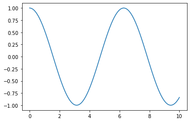
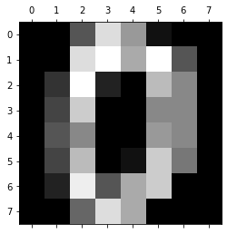

# **I. Tổng quan**

Machine Learning (máy học) là một nhánh của AI (trí tuệ nhân tạo), có khả năng tự cải thiện bản thân qua các dữ liệu mẫu và những gì đã được học.

ML thường được chia làm 2 loại: prediction (dự đoán) và classification (phân loại và gán nhãn)

Ban đầu việc xử lí vấn đề đơn thauafn chỉ là những câu lệnh điều kiện if…else, các quy tắc mà chúng ta tự định nghĩa. Có thể lồng ghép và thêm nhiều điều kiện để xử lí các vấn đề cụ thể hơn. Tuy nhiên việc xử lí như này sẽ dẫn đến 2 điểm yếu:

-	Mỗi một vấn đề cần một quy tắc logic khác nhau, khó sử dụng quy tắc để xử lí vấn đề này cho vấn đề khác, mặc dù chúng có điểm tương đồng
-	Để lập ra một số các quy tắc yêu cầu mức độ hiểu nhất định đối với vấn đề đó, tuy nhiên việc này khá là khó khăn. 

ML sẽ giúp xử lí những điểm yếu này. ML có thể phát hiện ra những mối tương quan giữa các vấn đề mà chúng ta khó có thể nhìn thấy được. ML có thể tự tìm hiểu và giải quyết vấn đề chúng gặp phải.


# **II, Làm việc với dữ liệu trong OpenCV với Numpy và Matplotlib**

# 1, Cách thức hoạt động của machine learning:
Luôn phải có 2 bước xử lí để vấn đề bằng ML:
-	Training phase (giai đoạn đào tạo): đào tạo mô hình máy học trên tập dữ liệu đào tạo.
-	Test phase (giai đoạn thử nghiệm): thử nghiệm và đánh giá mô hình máy học trên một tập dữ liệu mới chưa từng thấy.

Training phase là quá trình để tạo nên một mô hình máy học, và Test phase là bài kiểm tra để đánh giá mô hình của chúng ta hoạt động tốt như thế nào trên các tập dữ liệu mới. 
	Điều này giống như việc học và ứng dụng những kiến thức đã học để giải các bài tập hoặc làm việc ở con người.

# 2, Tiền xử lí dữ liệu
Thông thường các dữ liệu cần xử lí sẽ là hình ảnh, phim, chữ viết, âm thanh,… Để thực hiện việc train model trên các mẫu dữ liệu thuần túy như này là khá khó khăn, cho nên chúng ta phải có bước tiền xử lí dữ liệu cho phù hợp.

Gồm 2 giai đoạn:
-	Lựa chọn các thuộc tính, tính năng quan trọng trong bộ dữ liệu.
-	Chuyển đổi dữ liệu thô thành những thuộc tính, tính năng đã chọn ra 

Phát minh ra thuộc tính, tính năng để lựa chọn cũng khá quan trọng, để có thể chọn lọc ra các thuộc tính cần thiết thì sẽ phải có ai đó tìm hiểu ra nó trước.

Chú ý: Mọi điểm dữ liệu đều phải được gán nhãn, nhãn sẽ xác định điểm dữ liệu thuộc về loại sự vật hiện tượng nhất định nào đó. Mục tiêu của hệ thống máy học sẽ là dự đoán nhãn của tất cả các điểm dữ liệu trong bộ kiểm tra. Chúng ta sẽ phải kiểm tra hiệu suất máy học bằng cách so sánh kết quả gán nhãn của nó với bộ dữ liệu đã được gán nhãn sẵn.

Để xử lí các tập dữ liệu dạng ảnh, video thì chúng ta sẽ dùng OpenCV và Python

Video sẽ là tập hợp rất nhiều bức ảnh được phát ra liên tiếp nhau. Ảnh sẽ là tập hợp của các pixel (điểm ảnh) được đặt cạnh nhau. Chúng ta sẽ chuyển dữ liệu dạng ảnh thành mảng số, dãy số 2D này sẽ biểu thị độ sáng pixel trên một khu vực.


Xử lí được một số vấn đề đặc biệt của python:

1, Khi cần thay đổi toàn bộ giá trị của mảng đi một mức nhất định (ví dụ nhân mỗi giá trị của mảng lần 2 lần)

Không dùng numpy:


```python
int_list = list(range(10))
print("Input:", int_list)
int_list = int_list * 2
print("Output:", int_list)
```

    Input: [0, 1, 2, 3, 4, 5, 6, 7, 8, 9]
    Output: [0, 1, 2, 3, 4, 5, 6, 7, 8, 9, 0, 1, 2, 3, 4, 5, 6, 7, 8, 9]


Dùng numpy:


```python
import numpy as np 
int_list = list(range(10))
int_arr = np.array(int_list)
print("Input:", int_list)
int_arr = int_arr * 2
print("Output:", int_arr)
```

    Input: [0, 1, 2, 3, 4, 5, 6, 7, 8, 9]
    Output: [ 0  2  4  6  8 10 12 14 16 18]


Tương tự với phép chia, cộng, trừ,…

Kiểm tra các thuộc tính của mảng:

	.ndim: số chiều của mảng
	.shape: kích thước mảng
	.size: số phần tử trong mảng
	.dtype: kiểu dữ liệu của phần tử trong mảng


# 4, Trực quan hóa dữ liệu bằng Matplotlib
a, Vẽ một biểu đồ đơn giản
Ví dụ: Vẽ đồ thị của hàm cos(x) với 100 dữ liệu mẫu của x nằm trong khoảng từ 1 đến 10


```python
import matplotlib as mpl
import matplotlib.pyplot as plt
import numpy as np

x = np.linspace(0, 10, 100)
plt.plot(x, np.cos(x))
plt.show()
```





b, Mô phỏng dữ liệu từ bộ dữ liệu bên ngoài
Ví dụ: Trừu tượng hóa số viết tay từ bộ dữ liệu digits của sklearn


```python
import numpy as np 
import matplotlib.pyplot as plt
from sklearn.datasets import load_digits

digits = load_digits()
plt.matshow(digits.images[0])
plt.show()
```





```python

```
