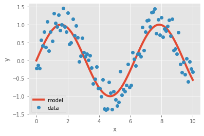

# **III, Supervised Learning**
Gồm 2 phần chính: 
-	Phân loại và gán nhãn: Dự đoán xem chính xác sự vật là gì, thuộc loại nào và gán nhán cho nó. Thông thường không thể tồn tại trường hợp nó là tổ hợp của 50% sự vật này + 50% sự vật khác.
o	Nếu chỉ có 2 lựa chọn: two-class/binrary classification
o	Nếu có nhiều lựa chọn: multi-class classtification
-	Phân tích hồi quy: Tính toán phương trình ước lượng dựa trên kết quả ước lượng tốt nhất của các mối quan hệ giữa các biến số. Dựa trên phương trình này sẽ tính toán ra được các biến phụ thuộc (biến chưa biết) từ các biến độc lập (biến đã biết). Áp dụng trong rất nhiều trường hợp thực tế như dự đoán giá cổ phiếu, dự đoán thời tiết,..

Cài đặt một mô hình ML trong OpenCV luôn có chung những phương thức:
-	Initialization: Khởi tạo mô hình rỗng
-	Set parameters: Đặt thông số cho mô hình
-	Train the model: Là phương thức train, tất cả model phải có phương thức này để điều chỉnh sao cho phù hợp với bộ dữ liệu
-	Predict new labels: Là phương thức predict, tất cả các model phải có phương thức này để dự đoán nhãn của dữ liệu mới
-	Score the model: Là phương thức calcError, dùng để tính hiệu suất của model, đánh giá model

# 1, Đánh giá model 
a, Đánh giá model phân loại và gán nhãn sử dụng accuracy, precision, and recall
-	accuracy_score: tỉ lệ số dự đoán đúng trên tổng số dự đoán
-	precision_score: tỉ lệ số kết quả thực sự đúng trên số dự đoán được cho là đúng
-	recall_score: tỉ lệ số kết quả chúng ta đã dự đoán đúng trong số mẫu đúng
Xét ví dụ với bài toán: Có 3 lớp dữ liệu được gán nhãn là 0, 1, 2
Bộ dữ liệu thực sự là y_true = [0, 1, 2, 0, 0 , 1, 0, 2, 1, 1]
Bộ dữ liệu chúng ta cần đánh giá là y_pre = [0, 0, 2, 0, 0, 1, 1, 2, 2, 1]

Đoạn code dưới đây cho kết quả là accuracy, precision và recall của bộ dữ liệu:


```python
from sklearn.metrics import accuracy_score, precision_score, recall_score
import numpy as np 

y_pred = np.array([0, 0, 2, 0, 0, 1, 1, 2, 2, 1])
y_true = np.array([0, 1, 2, 0, 0, 1, 0, 2, 1, 1])

print("accuracy = ", accuracy_score(y_true, y_pred))
print("precision = ", precision_score(y_true, y_pred, average = "macro"))
print("recall = ", recall_score(y_true, y_pred, average = "macro"))
```

    accuracy =  0.7
    precision =  0.6944444444444443
    recall =  0.75


Các thông số accuracy, precision, recall càng cao thì mô hình càng tốt

b, Đánh giá model hồi quy sử dụng mean squared error, explained variance và R squared

-	mean_squared_error: là sai số trung bình giữa các giá trị được dự đoán và thực tế, luôn không âm và các giá trị cần gần 0 càng tốt


Trong đó n là số điểm dữ liệu, Yi là giá trị quan sát, Ŷ là giá trị dự đoán


-	r2_score: còn được gọi là hệ số xác định, miền giá trị từ 0 đến 1 để đo lường mức độ phù hợp của đường hồi quy so với dữ liệu. 

Công thức tính R2 sẽ so sánh đường hồi quy phù hợp với một mô hình cơ sở. Mô hình cơ sở là một đường phẳng dự đoán mọi giá trị của y sẽ là giá trị trung bình của y. R2 kiểm tra xem đường hồi quy của chúng ta có tốt hơn đường hồi quy trung bình hay không


  - SSRES: Tổng thặng dư của phương sai 
  - SSTOT: Tổng số phương sai 


Ví dụ về vẽ đường hồi quy:


```python
from ast import increment_lineno
import matplotlib.pyplot as plt
from sklearn.metrics import accuracy_score, precision_score, recall_score
import numpy as np

x = np.linspace(0, 10, 100)
y_true = np.sin(x) + np.random.rand(x.size) - 0.5
y_pred = np.sin(x)

plt.style.use('ggplot')
plt.plot(x, y_pred, linewidth = 4, label = "model")
plt.plot(x, y_true, 'o', label = 'data')
plt.xlabel('x')
plt.ylabel('y')
plt.legend(loc = 'lower left')
plt.show()
```





Giá trị mean_square_score tương ứng:


```python
mse = np.mean((y_true - y_pred) ** 2)
print(mse)
```

    0.08790720767601973


MSE càng nhỏ thì phương trình càng chính xác, ở đây với mse = 0,087 thì phương trình chúng ta khá gần thực tế.


```python
r2 = 1.0 - mse/np.var(y_true)
print(r2)
```

    0.8519171519490287


Và chúng ta cũng sẽ tính được r2 score dựa trên mse, với mô hình của chúng ta sẽ có r2_score = 0.85, rất gần với 1. R2_score cũng có thể nhận giá trị âm, vì các dự đoán của mô hình có thể tùy ý, và bé thua 1. Nếu mô hình dự đoán y không phụ thuộc vào x thì điểm R2 sẽ bằng 0.

# 2, Sử dụng mô hình phân loại để dự đoán lớp và nhãn 
Thuật toán k-NN: Là thuật toán supervised-learning đơn giản nhất. 
-	Trong bài toán phân loại, nhãn của một dữ liệu mới sẽ được quyết định bằng nhãn của các điểm gần với nó, hoặc đánh trọng số cho các điểm gần nó rồi dựa trên trọng số đó để suy ra nhãn của điểm mới này.
-	Trong bài toán ước lượng, đầu ra của một dữ liệu mới sẽ chính bằng đầu ra của điểm dữ liệu đã biết gần nó nhất, hoặc là trung bình của các trọng số đầu ra của những điểm gần nó nhất
	Không phải training, việc dự đoán rất đơn giản nhưng khó xử lí nhiễu. Việc tính toán khoảng cách tới từng điểm dữ liệu sẽ rất tốn thời gian. Khó áp dụng với bộ dữ liệu lớn và K lớn
Ví dụ: Dự đoán phân loại hoa bằng thuật toán KNN 


    


