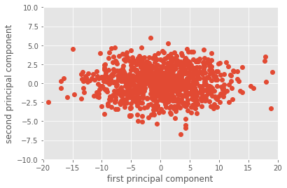

**Feature Engineering là gì?**


Là kĩ thuật xử lí, chọn lọc thuộc tính của dữ liệu mẫu cho phù hợp với việc giải quyết các vấn đề
Được chia thành hai giai đoạn:
  -	Feature selection: Quá trình xác định các thuộc tính quan trọng trong dữ liệu. 
  -	Feature extraction: Quá trình chuyển đổi dữ liệu thô thành các thuộc tính mong muốn để sư dụng các thuật toán ML


Xử lí dữ liệu càng tốt thì mô hình chúng ta càng hoạt động tốt hơn, bước tiền xử lí gồm 3 nội dung chủ yếu:
-	Định dạng dữ liệu (Data formatting): Dữ liệu có thể không có định dạng phù hợp để làm việc, vậy nên chúng ta cần xem xét nó.
-	Làm sạch dữ liệu (Data cleaning): Xử lí các phần rác, không liên quan trong dữ liệu
-	Lấy mẫu dữ liệu (Data sampling): Dữ liệu có thể quá lớn nên chúng ta phải chọn lọc


Sau đó là bước biển đổi dữ liệu, thường gồm 3 bước:

-	Chia tỷ lệ: Dữ liệu sử dụng trong các thuật toán máy học cần phải đưa về một phạm vi giá trị chung
-	Phân rã: Tập dữ liệu thường có nhiều tính năng hơn chúng ta có thể xử lý. Phân rã tính năng là quá trình nén dữ liệu thành các thành phần dữ liệu nhỏ hơn nhưng có thuộc tính tốt hơn.
-	Tổng hợp: Ngược lại với phân rã, chúng ta tổng hợp các thuộc tính lại thành một thuộc tính tốt hơn

---


**Feature Scaling and Normalization**

Các điểm dữ liệu đôi khi được đo đạc với những đơn vị khác nhau, m và feet chẳng hạn. Hoặc có hai thành phần (của vector dữ liệu) chênh lệch nhau quá lớn, một thành phần có khoảng giá trị từ 0 đến 1000, thành phần kia chỉ có khoảng giá trị từ 0 đến 1 chẳng hạn. Lúc này, chúng ta cần chuẩn hóa dữ liệu trước khi thực hiện các bước tiếp theo.

Một vài phương pháp chuẩn hóa thường dùng: 
- Standardization: chia dữ liệu với kỳ vọng = 0 và phương sai = 1
- Rescaling: Đưa tất cả các thành phần về cùng một khoảng, [0, 1] hoặc [−1,1] chẳng hạn, tùy thuộc vào ứng dụng.
- Scaling to unit length: chuẩn hóa các thành phần của mỗi vector dữ liệu sao cho toàn bộ vector có độ lớn (Euclid, tức norm 2) bằng 1

---


**Handling the missing data**

Một số tập data có thể bị thiếu dữ liệu, ví dụ:


```python
from numpy import nan
import numpy as np
X = np.array([[ nan, 0, 3 ],
[ 2, 9, -8 ],
[ 1, nan, 1 ],
[ 5, 2, 4 ],
[ 7, 6, -3 ]])
```

ML không thể xứ lí dữ liệu nan, nên chúng ta cần phải thay thế các dữ liệu dạng như này bằng một số giá trị thích hợp. 
Có một số cách để xử lí như:
- 'mean', 'median': thay thế toàn bộ nan bằng giá trị trung vị, trung bình dọc theo một trục của ma trận
- 'most_frequent': Thay thế tất cả các giá trị nan bằng giá trị xuất hiện nhiều nhất theo một trục của ma trận


```python
from sklearn.impute import SimpleImputer
#thay thế các giá bị khuyết bằng mean
imp = SimpleImputer(missing_values=np.nan, strategy='mean')
X2 = imp.fit_transform(X)
print(X2)

```

    [[ 3.75  0.    3.  ]
     [ 2.    9.   -8.  ]
     [ 1.    4.25  1.  ]
     [ 5.    2.    4.  ]
     [ 7.    6.   -3.  ]]


**Dimensionality reduction**

Hiện tại, hầu hết các tập dữ liệu mà chúng ta cần xử lí đều là dữ liệu đa chiều (high-dimension). Tập dữ liệu đa chiều thì lại thường chứa các thuộc tính kém, làm nhiễu và giảm hiệu năng của mô hình. Và việc lựa chọn những thuộc tính có nhiều ý nghĩa, ảnh hưởng lớn đến kết quả cũng khó khăn hơn. Vậy nên chúng ta cần giảm số chiều của dữ liệu xuống (dimensionality reduction).

Dimensionality reduction giúp cải thiện độ chính xác của model, giúp việc huấn luyện model nhanh hơn, dễ phân tích kết quả, dễ mô hình hóa model dưới dạng 2D hoặc 3D.


Các phương pháp phổ biến thường được sử dụng:
  - **Missing values ratio**: Như ở trên mục handle the missing data, ta sẽ thấy một số cột có dữ liệu là "nan", nếu cột nào có quá nhiều dữ liệu bị khuyết mất như này thì thường không đóng góp được gì nhiều cho kết quả nên chúng ta sẽ loại nó đi
  - **Low-variance filter**: phương sai thấp - nghĩa là mức độ chênh lệch, sai sót giữa tập dữ liệu huấn luyện và tập dữ liệu gốc khá nhỏ, bởi vì nhỏ nên cũng ít gây ảnh hưởng đến kết quả, chúng ta có thể loại nó đi
  - **High-correlation filter**: Các thuộc tính có sự liên hệ với nhau, cái này phụ thuộc cái kia hoặc được suy ra từ cái kia thì chúng ta có thể chọn lọc và bỏ đi, việc tồn tại nhiều dữ liệu như thế trong mô hình sẽ gây nhiễu mô hình
  - **PCA(Principal component analysis)**: dữ liệu ban đầu của chúng ta có thể đang ở một chiều mà dữ liệu chồng chéo lên nhau, khó phân tích. Dựa trên một số tính toán, thông số từ PCA mà chúng ta có thể xoay nó theo một hướng nhất định và khiến cho dữ liệu có thể dễ dàng chia tách ra, đây là phương pháp giảm chiều dữ liệu sao cho thông tin được giữ lại nhiều nhất
  - **SVD(Singular Value Composition)**: Dựa trên phát biểu SVD, mọi ma trận A(m*n) bất kì đều có thể phân tích thành dạng:    với U, V là ma trận trực giao, V là ma trận đường chéo (tham khảo thêm về lí thuyết ma trận). Từ đó chúng ta có thể chia nhỏ ma trận A thành 3 ma trận con để dễ dàng xử lí hơn

**Principal Component Analysis (PCA) trong OpenCV**

PCA là một trong những phương pháp dimensionality reduction

Phương pháp này dựa trên quan sát rằng dữ liệu thường không phân bố ngẫu nhiên trong không gian mà thường phân bố gần các đường/mặt đặc biệt nào đó. 

Ví dụ với bài toán phân loại, ở một góc nhìn mà các vật thể đè lên nhau và co cụm lại một chỗ thì chúng ta không thể phân loại nổi. Vậy nên chúng ta phải tìm được đường hay mặt phẳng khác để chia tách chúng thành 2 phần khác nhau cho 2 class khác nhau


Thử xem xét với một tập dữ liệu với 2 thuộc tính là x và y. Các thuộc tính này có thể coi như là giá trị thang độ xám của pixel ở một số vị trí x và y. Chúng ta vẽ tập dữ liệu (khoảng 1000 samples) dọc theo 2 trục thuộc tính này:


```python
import numpy as np
mean = [20, 20]
cov = [[5, 0], [25, 25]]
x, y = np.random.multivariate_normal(mean, cov, 1000).T

import matplotlib.pyplot as plt
plt.style.use('ggplot')
%matplotlib inline
plt.plot(x, y, 'o', zorder=1)
plt.axis([0, 40, 0, 40])
plt.xlabel('feature 1')
plt.ylabel('feature 2')

```

    /usr/local/lib/python3.7/dist-packages/ipykernel_launcher.py:4: RuntimeWarning: covariance is not positive-semidefinite.
      after removing the cwd from sys.path.


    Text(0, 0.5, 'feature 2')


Trước tiên, chúng ta phải gộp 2 ma trận x, y thành một ma trận duy nhất là X
sau đó thực hiện PCA:


```python
#gộp 2 ma trận
X = np.vstack((x, y)).T
import cv2

#tính ra mean và eigenvector phù hợp
mu, eig = cv2.PCACompute(X, np.array([]))
print(eig)
```

    [[ 0.72307258  0.69077206]
     [-0.69077206  0.72307258]]


```python
plt.plot(x, y, 'o', zorder=1)
plt.quiver([20, 20], eig[:, 0], eig[:, 1], zorder=2, scale = 0.2, units='xy')

```


    <matplotlib.quiver.Quiver at 0x7fa421b28210>





Kết quả:


```python
X2 = cv2.PCAProject(X, mu, eig)

plt.plot(X2[:, 0], X2[:, 1], 'o')
plt.xlabel('first principal component')
plt.ylabel('second principal component')
plt.axis([-20, 20, -10, 10])
```


    (-20.0, 20.0, -10.0, 10.0)


    


