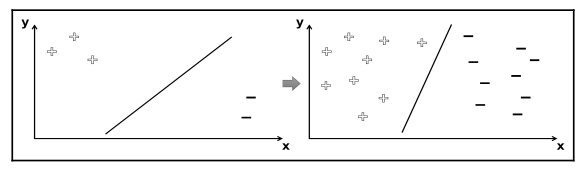
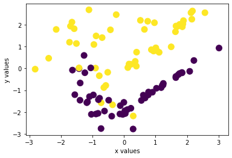
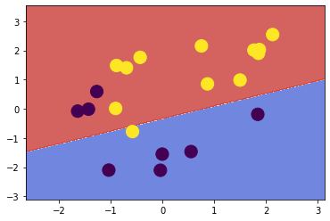
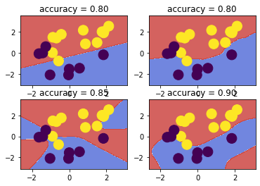

# **Support Vector Machines**

Giả sử chỉ có 2 dữ liệu để phân loại là (+) và (-)

SVM sẽ phân chia tập dữ liệu của chúng ta thành 2 phần, với bên phải hầu như sẽ chứa các giả trị (+) còn bên trái sẽ chứa các giá trị (-)



Khởi tạo bộ dữ liệu


```python
from sklearn import datasets
import matplotlib.pyplot as plt

X, y = datasets.make_classification(n_samples=100, n_features=2,
n_redundant=0, n_classes=2,
random_state=7816)

plt.scatter(X[:, 0], X[:, 1], c=y, s=100)
plt.xlabel('x values')
plt.ylabel('y values')
```


    Text(0, 0.5, 'y values')





Trước đó, chúng ta sẽ tiền xử lí data để phù hợp với OpenCV:
- Tất cả các giá trị trong X phải là kiểu float 32
- Nhãn phải là -1 hoặc +1


```python
import numpy as np
X = X.astype(np.float32)
y = y * 2 - 1

from sklearn import model_selection as ms
X_train, X_test, y_train, y_test = ms.train_test_split(
X, y, test_size=0.2, random_state=42
)
```

Building SVM:


```python
import cv2
svm = cv2.ml.SVM_create()

svm.setKernel(cv2.ml.SVM_LINEAR)

svm.train(X_train, cv2.ml.ROW_SAMPLE, y_train)

_, y_pred = svm.predict(X_test)

from sklearn import metrics
metrics.accuracy_score(y_test, y_pred)
```


    0.8


Hiển thị đường decision


```python
 def plot_decision_boundary(svm, X_test, y_test):
   x_min, x_max = X_test[:, 0].min() - 1, X_test[:, 0].max() + 1
   y_min, y_max = X_test[:, 1].min() - 1, X_test[:, 1].max() + 1
   h = 0.02 # step size in mesh
   xx, yy = np.meshgrid(np.arange(x_min, x_max, h),
   np.arange(y_min, y_max, h))
   X_hypo = np.c_[xx.ravel().astype(np.float32),
   yy.ravel().astype(np.float32)]

   X_hypo = np.c_[xx.ravel().astype(np.float32),
   yy.ravel().astype(np.float32)]
   _, zz = svm.predict(X_hypo)

   _, zz = svm.predict(X_hypo)

   zz = zz.reshape(xx.shape)
   plt.contourf(xx, yy, zz, cmap=plt.cm.coolwarm, alpha=0.8)

   plt.scatter(X_test[:, 0], X_test[:, 1], c=y_test, s=200)

plot_decision_boundary(svm, X_test, y_test)
```





Tuy nhiên hãy xét một trường hợp phức tạp hơn, dữ liệu đầu vào của chúng ta không được xử lí tối ưu để có thể vẽ decision boundary.

Ý tưởng ban đầu là ánh xạ dữ liệu của chúng ta thành không gian có nhiều chiều hơn (ví dụ 2D thành 3D):


Tuy nhiên ví dụ này chưa được tổng quát, chúng ta cần rất nhiều thứ bổ sung để thực hiện phép chiếu, đây là lúc kernel trick xuất hiện

# **Kernel Trick**

Để tìm ra độ dốc và hướng của decision hyperplane trong không gian nhiều chiều, chúng ta phải nhân tất cả các giá trị của đối tượng với các giá trị trọng số thích hợp, rồi tính tổng chúng lại. Không gian càng nhiều, việc này càng khó khăn hơn.

Tuy nhiên, SVM không cần thiết phải hoạt động quá rõ ràng ở không gian có chiều cao hơn. Vấn đề cần tối ưu hóa chỉ là tính tích vô hướng các cặp thuộc tính. Kernel functions có thể tính toán các giá trị này mà không cần phải chuyển đổi dữ liệu thành chiều cao hơn.

Thử triển khai nó với một ví dụ 


```python
kernels = [cv2.ml.SVM_LINEAR, cv2.ml.SVM_INTER,
cv2.ml.SVM_SIGMOID, cv2.ml.SVM_RBF]

```


```python
for idx, kernel in enumerate(kernels):
  svm = cv2.ml.SVM_create()
  svm.setKernel(kernel)

  svm.train(X_train, cv2.ml.ROW_SAMPLE, y_train)

  _, y_pred = svm.predict(X_test)
  accuracy = metrics.accuracy_score(y_test, y_pred)

  plt.subplot(2, 2, idx + 1)
  plot_decision_boundary(svm, X_test, y_test)
  plt.title('accuracy = %.2f' % accuracy)
```





Đầu tiên, mô hình trái trên tạo ra một đường thẳng gần giống với SVM cũ của chúng ta

Biểu đồ ở trên phải vẽ ra một đường cong có phức tạp hơn, nhưng accuracy mới chỉ 0.8

Biểu đồ ở trái dưới tuy có accuracy khá cao = 0.85 nhưng đường phân tách của chúng ta lại không rõ ràng

Ở biểu đồ cuối cùng, đường Gaussian kernel có accuracy = 0.9, tuy vẫn có sai sót nhưng nó vẽ ra đường ranh giới tốt nhát trong cả 4 cách

# Phương pháp mô tả đặc trưng HOG (Histogram of Oriented Gradients)

HOG là viết tắt của Histogram of Oriented Gradient - một loại “feature descriptor”. Mục đích của “featura descriptor” là trừu tượng hóa đối tượng bằng cách trích xuất ra những đặc trưng của đối tượng đó và bỏ đi những thông tin không hữu ích. Vì vậy, HOG được sử dụng chủ yếu để mô tả hình dạng và sự xuất hiện của một đối tượng trong ảnh

Bản chất của phương pháp HOG là sử dụng thông tin về sự phân bố của các cường độ gradient (intensity gradient) hoặc của hướng biên (edge directins) để mô tả các đối tượng cục bộ trong ảnh. Các toán tử HOG được cài đặt bằng cách chia nhỏ một bức ảnh thành các vùng con, được gọi là “tế bào” (cells) và với mỗi cell, ta sẽ tính toán một histogram về các hướng của gradients cho các điểm nằm trong cell. Ghép các histogram lại với nhau ta sẽ có một biểu diễn cho bức ảnh ban đầu. Để tăng cường hiệu năng nhận dạng, các histogram cục bộ có thể được chuẩn hóa về độ tương phản bằng cách tính một ngưỡng cường độ trong một vùng lớn hơn cell, gọi là các khối (blocks) và sử dụng giá trị ngưỡng đó để chuẩn hóa tất cả các cell trong khối. Kết quả sau bước chuẩn hóa sẽ là một vector đặc trưng có tính bất biến cao hơn đối với các thay đổi về điều kiện ánh sáng.

Có 5 bước cơ bản để xây dựng một vector HOG cho hình ảnh, bao gồm:
  - Tiền xử lý
  - Tính gradient
  - Tính vector đặc trưng cho từng ô (cells)
  - Chuẩn hóa khối (blocks)
  - Tính toán vector HOG


Tìm hiểu rõ hơn về từng bước của HOG qua https://learnopencv.com/histogram-of-oriented-gradients/?fbclid=IwAR18at-SxmVl7Uqb8_7wjpj5r6T0NzpSK-g9yc8i2QWd8WD_RGfKyVQZ-4U

# **Nhận hiện người đi bộ qua SVM và HOG**

Sử dụng bộ dữ liệu được tải lên để train cho model bằng file code **train_HOG_SVM.py** hoặc sử dụng model đã được train sẵn ở dưới.

Sau đó sử dụng model đã train được để tiến hành nhận diện bằng đoạn code **test_HOG_SVM.py**


    


