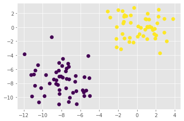
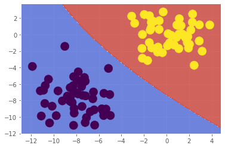

# **Bayesian Learning**

Naive Bayes classifiers bắt nguồn từ định lý Bayes. Chúng ta có thể sử dụng định lý Bayes để xây dựng mô hình có thể vừa phân loại dữ liệu vừa ước tính được khả năng phân loại của chúng ta. Ví dụ chúng ta có thể sử dụng suy luận Bayes để loại bỏ email spam với độ tin cậy cao, xác định xác suất của người bệnh,...

Các thuật toán phân loại thường thấy như k-NN hay decision tree có thể dự đoán cho chúng ta biết nhãn của một điểm dữ liệu chưa từng thấy, nhưng chưa có khái niệm nào cho thấy chúng có thể cho chúng ta biết rằng những dự đoán đó đúng hay sai. Còn các mô hình Bayes không những có thể gán nhãn cho dữ liệu mà còn có thể tạo ra các điểm dữ liệu mới cùng một số liệu thống kê dựa trên phân phối xác suất.


# Cách thức hoạt động

Xét bài toán sau:
  - Có 1% phụ nữ ở độ tuổi 40 tham gia khám sàng lọc định kỳ và bị ung thư vú. 80% bị ung thư sẽ được chẩn đoán dương tính; 9,6% phụ nữ không bị ung thư cũng được chẩn đoán dương tính. Vậy xác xuất một phụ nữ trong độ tuổi này thực sự bị ung thư khi được chẩn đoán dương tính là bao nhiêu?

Giả sử có 10,000 phụ nữ tham gia khám sàng lọc, chúng ta có thể chia họ thành 4 nhóm:
  - Nhóm 1: 80 phụ nữ bị ung thư vú và được chẩn đoán dương tính
  - Nhóm 2: 20 phụ nữ bị ung thứ vú và được chẩn đoán âm tính
  - Nhóm 3: 950 phụ nữ không bị ung thư vú và được chẩn đoán dương tính
  - Nhóm 4: 8950 phụ nữ không bị ung thư vú và được chẩn đoán âm tính

Chúng ta sẽ gọi Nhóm 1 và Nhóm 2 là X, nhóm 3 và nhóm 4 là Y:


Chúng ta có thể thấy, nửa bên trái là số phụ nữ được chẩn đoán dương tính, nửa bên phải là số phụ nữ được chẩn đoán âm tính, nửa trên là số phụ nữ thực sự mắc ung thư còn nửa dưới là không mắc.

Dựa trên biểu đồ sẽ tính được tỉ lệ số phụ nữ thực sự mắc ung thư khi được chẩn đoán dương tính là: 80 / (80 + 950) = 7,8%

Cái chúng ta vừa tính được gọi là xác xuất có điều kiện, công thức tổng quát:


Nhờ định lý Bayes chúng ta có thể biểu diễn p(C, M) như sau:

  - p(C, M) = p(M|C).p(C)

Từ đó ta có công thức:


Trong đó: 
  - p(C|M) được gọi là posterior, kết quả cuối cùng chúng ta cần tính ra
  - p(C) được gọi là prior, tương ứng với kiến thức ban đầu chúng ta biết về mức độ phổ biến của bệnh, coi là mức độ tin tưởng của C
  - p(M|C) được gọi là likehood (khả năng xảy ra)
  - p(M) được gọi là evidence
Từ đó ta có:  **posterior = prior * likehood / evidence**


# Bayes classifier 

Tuy nhiên, trong các tình huống thực tế, chúng ta phải dự đoán một kết quả (chẳng hạn như biến ngẫu nhiên Y) với nhiều evidence (chẳng hạn như 2 biến ngẫu nhiên X1, X2). Thay vì tính p(Y|X) chúng ta phải tính p(Y|X1, X2,...,Xn). Việc này khá là phức tạp, ví dụ với 2 biến X1, X2 thì chúng ta sẽ có công thức: 
  - p(Y, X1, X2) = p(X1|X2,Y) * p(X2|C) * p(C)

Tệ nhất là phần p(X1|X2, Y), nghĩa là X1 phụ thuộc vào tất cả các biến khác kể cả Y. Nó còn tệ hơn khi tính toán với n biến.

Tuy nhiên, phân loại Bayes đơn giản là bỏ qua hết và giả định rằng tất cả Xi độc lập với nhau (thực tế khó xảy ra giả định này, chúng ta có thể gọi đó là giả định hơi ngây thơ, nên mới sinh ra tên gọi Bayes ngây thơ). Từ đó chúng ta có công thức đơn giản hóa:
  - p(C|X1, X2) = p(X1|C) * p(X1|C) * p(X2|C) * p(C)

Tương tự với n biến Xi

# Thử nghiệm trên tập dữ liệu

Chúng ta sẽ tạo bộ dữ liệu gồm 100 điểm dữ liệu có thể là 2 màu xanh hoặc vàng ở hai cụm điểm khác nhau và không chồng chéo lên nhau.


```python
from sklearn import datasets
X, y = datasets.make_blobs(100, 2, centers=2, random_state=1701, cluster_std=2)
```


```python
import matplotlib.pyplot as plt
plt.style.use('ggplot')

plt.scatter(X[:, 0], X[:, 1], c=y, s=50);
```





Tương tự linear classifier sẽ cố gắng vẽ một đường thẳng qua hình, cố gắng đặt các chấm xanh ở 1 bên và chấm vàng ở một bên. Vậy nên ở đây chúng ta sẽ xét một công việc phân loại tương đối dễ dàng, ngay cả với Bayes Naive Classifier.


```python
#Chia tập dữ liệu training
import numpy as np
from sklearn import model_selection as ms
X = X.astype(np.float32)
X_train, X_test, y_train, y_test = ms.train_test_split(X, y, test_size=0.1)
```

# Phân loại với Normal Bayes

OpenCV không cung cấp Bayes Naive thực sự, thay vào đó nó lại sử dụng bộ phân loại Bayes mà các thuộc tính không nhất thiết độc lập mà được nhóm lại giống như tập dữ liệu chúng ta đã tạo.


```python
import cv2
model_norm = cv2.ml.NormalBayesClassifier_create()

model_norm.train(X_train, cv2.ml.ROW_SAMPLE, y_train)

```


    True


Trả về True nghĩa là tập dữ liệu được training thành công


```python
_, y_pred = model_norm.predict(X_test)
from sklearn import metrics
metrics.accuracy_score(y_test, y_pred)

```


    1.0


Chúng ta còn có thể kiểm tra decision boundary (chương trước), ý tưởng là tạo một lưới bao tất cả dữ liệu và phân loại trên lưới, sử dụng mesh grid từ Numpy:


```python
def plot_decision_boundary(model, X_test, y_test):
  # create a mesh to plot in
  h = 0.02 # step size in mesh
  x_min, x_max = X_test[:, 0].min() - 1, X_test[:, 0].max() + 1
  y_min, y_max = X_test[:, 1].min() - 1, X_test[:, 1].max() + 1
  xx, yy = np.meshgrid(np.arange(x_min, x_max, h),
  np.arange(y_min, y_max, h))
  #Hàm meshgrid sẽ trả về 2 ma trận chứa tọa độ x và y của mọi điểm trên lưới, chúng ta sẽ chuyển nó về một ma trận X_hypo:
  X_hypo = np.column_stack((xx.ravel().astype(np.float32), yy.ravel().astype(np.float32)))
  #Format này để cho hàm predict có thể sử dụng
  ret = model.predict(X_hypo)
  #Mô hình OpenCV trả về nhiều biến boolean cho biết thành công/thất bại và nhãn của mục tiêu, trong khi scikit-learning chỉ trả về nhãn
  #Chúng ta kiểm tra ret trả về để biết đang xử lí OpenCV hay scikit-learning
  if isinstance(ret, tuple):
    zz = ret[1]
  else:
    zz = ret
  zz = zz.reshape(xx.shape)

  #Cuối cùng chỉ cần vẽ đường viền
  plt.contourf(xx, yy, zz, cmap=plt.cm.coolwarm, alpha=0.8)
  plt.scatter(X_test[:, 0], X_test[:, 1], c=y_test, s=200)
  
plot_decision_boundary(model_norm, X, y)


```





```python
#Bayesian Classifier cũng trả về xác xuất mà mỗi điểm dữ liệu được phân loại
ret, y_pred, y_proba = model_norm.predictProb(X_test)
#y_pred là nhãn của điểm dữ liệu
#y_proba là mảng 2 chiều tương ứng với thứ tự là tỉ lệ mà nó dự đoán xem điểm dữ liệu có thể là class 0 hay class 1
y_proba.round(2)
```


    array([[0.09, 0.  ],
           [0.  , 0.11],
           [0.27, 0.  ],
           [0.  , 0.08],
           [0.  , 0.33],
           [0.  , 0.35],
           [0.01, 0.  ],
           [0.14, 0.  ],
           [0.12, 0.  ],
           [0.25, 0.  ]], dtype=float32)


