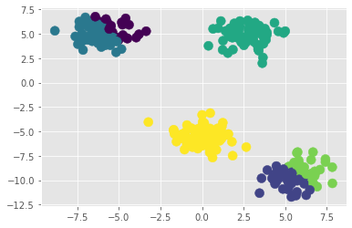

# **Unsupervised Learning**


Các chương trước tập trung vào việc xử lí các vấn đề supervised learning, khi mà mọi điểm giá trị trong tập dữ liệu đã được gán nhãn hoặc có giá trị đích. Còn chương này sẽ tập trung vào xử lí những loại dữ liệu không biết trước đấu ra hoặc không có "người giám sát"

Mục đích của unsupervised learning là chuyển dữ liệu gốc thành dạng biểu diễn phong phú hơn, có ý nghĩa hơn, giúp con người dễ hiểu và giúp các thuật toán máy học phân tích dữ liệu dễ dàng hơn

Một số ứng dụng phổ biển của unsupervised learning:
  - Dimensionality reduction: Giảm số chiều của dữ liệu, chọn lọc và trích xuất những thuộc tính quan trọng có nhiều ý nghĩa (chúng ta đã nói ở trên chapter 4)
  - Factor analysis: Cố gắng tìm những căn nguyên ẩn hoặc những dữ liệu mà chúng ta chưa biết mà từ những thứ này hình thành nên dữ liệu mà chúng ta đã biết
  - Cluster analysis: Phân vùng dữ liệu thành các nhóm riêng biệt mà mỗi nhóm sẽ chứa các loại dữ liệu giống nhau

Ở chương này chúng ta sẽ tìm hiểu một số thuật toán Cluster Analysis

# Thuật toán k-means clustering 


Là thuật toán cơ bản nhất mà OpenCV cung cấp, dùng để tìm kiếm một số lượng nhóm đã biết trước trong tập dữ liệu

Thuật toán k-means lấy cơ sở từ 2 giả định đơn giản:
  - Trung tâm của các nhóm chỉ đơn giản là trung bình cộng của các điểm trong nhóm
  - Mỗi điểm gần trung tâm của cụm của nó hơn các trung tâm của cụm khác

Thử tạo một tập dữ liệu với 4 nhóm 4 màu riêng biệt, và vì đây là unsupervised learning nên chúng ta sẽ không gán nhãn cho chúng


```python
import matplotlib.pyplot as plt
%matplotlib inline
plt.style.use('ggplot')
```


```python
from sklearn.datasets import make_blobs
X, y_true = make_blobs(n_samples=300, centers=4, cluster_std=1.0, random_state=10)
plt.scatter(X[:, 0], X[:, 1], s=100);
```


Chúng ta có thể dễ dàng nhìn thấy được 4 cụm trong tập dữ liệu đã tạo

Chúng ta có thể dễ dàng sử dụng k-means mà opencv đã tích hợp sẵn:


```python
import cv2
criteria = (cv2.TERM_CRITERIA_EPS + cv2.TERM_CRITERIA_MAX_ITER, 10, 1.0)
flags = cv2.KMEANS_RANDOM_CENTERS
import numpy as np
#chỉ định số lượng cụm là 4
compactness, labels, centers = cv2.kmeans(X.astype(np.float32), 4, None, criteria, 10, flags)
```

Có 3 kết quả trả về gồm:
  - compactness: tổng bình phương khoảng cách của các điểm đến trung tâm cụm của chúng, compactness score càng cao thì càng chỉ ra các điểm gần trung tâm cụm của chúng, thấp thì có thể các cụm không được phân tác rõ ràng
  - labels và centers là nhãn và trumg tâm của cụm


```python
compactness
```


    526.6774351084605


```python
#tô màu cho chúng
plt.scatter(X[:, 0], X[:, 1], c=labels, s=50, cmap='viridis')
plt.scatter(centers[:, 0], centers[:, 1], c='black', s=200, alpha=0.5);
```


# Expectation-maximization (cực đại hóa kỳ vọng)


Ở trên chúng ta đã tìm hiểu về thuật toán k-means, thực chất nó chỉ là một ứng dụng cụ thể của expectation-maximization (EM). 

Tổng quát hóa thì EM hoạt động như sau:
  - Chọn một trung tâm cụm ngẫu nhiên
  - Lặp lại quá trình cho đến khi các điểm được nhóm thành 1 cụm:
      - **Expectation step**: gán nhãn cho các dữ liệu gần trumg tâm cụm 
      - **Maximization step**: cập nhật lại trung tâm cụm bằng cách tính giá trị trung bình của tất cả các điểm trong cụm

Thử cài đặt thuật toán:


```python
from sklearn.metrics import pairwise_distances_argmin
def find_clusters(X, n_clusters, rseed=5):
  rng = np.random.RandomState(rseed)
  i = rng.permutation(X.shape[0])[:n_clusters]
  centers = X[i]
  while True:
    labels = pairwise_distances_argmin(X, centers)
    new_centers = np.array([X[labels == i].mean(axis=0)
    for i in range(n_clusters)])
    if np.all(centers == new_centers):
      break
    centers = new_centers
    return centers, labels
centers, labels = find_clusters(X, 4, rseed = 30)
plt.scatter(X[:, 0], X[:, 1], c=labels, s=100, cmap='viridis');
```


# Hạn chế của thuật toán tối đa hóa kỳ vọng

Tuy thuật toán hoạt động thuật toán khá tốt trong một số tình huống, song nó khá đơn giản nên vẫn tiềm ẩn những hạn chế:
  - Không đảm bảo rằng sẽ tìm ra giải pháp tốt nhất
  - Phải biết trước số lượng cụm, nhóm
  - Thuật toán sẽ chậm với bộ dữ liệu lớn

**1, Sự thiếu đảm bảo**

Nếu chúng ta sử dụng trung tâm cụm ngẫu nhiên khác (rseed = 50 thay vì 30) kết quả sẽ xấu đi:


```python
centers, labels = find_clusters(X, 4, rseed = 50)
plt.scatter(X[:, 0], X[:, 1], c=labels, s=100, cmap='viridis');
```


Bởi vì việc chọn trung tâm cụm ngẫu nhiên khiến cho một số điểm đáng lẽ là màu vàng lại mang nhãn màu tím, vậy nên việc quyết định trung tâm cụm là khá quan trọng, hoặc chúng ta phải thử trong nhiều trường hợp

**2, Phải chọn trước số lượng cụm**

Nếu chúng ta chọn số lượng khác đi, ví dụ là 6 cụm thay vì 4 cụm:


```python
criteria = (cv2.TERM_CRITERIA_EPS + cv2.TERM_CRITERIA_MAX_ITER, 10, 1.0)
flags = cv2.KMEANS_RANDOM_CENTERS

#chỉ định số lượng cụm là 6
compactness, labels, centers = cv2.kmeans(X.astype(np.float32), 6, None, criteria, 10, flags)

plt.scatter(X[:, 0], X[:, 1], c=labels, s=100, cmap='viridis');
```





Và giờ kết quả của chúng ta đã chia ra thành 6 màu, tương ứng 6 cụm.

Bởi vì là dữ liệu chúng ta tạo nên chúng ta biết trước số cụm là 4, nhưng đối với những tập dữ liệu rắc rối hơn thì chúng ta phải thử kiểm tra trước số cụm của chúng. Chúng ta có thể sử dụng elbow method để vẽ biểu đồ kiểm tra toàn bộ dãy giá trị của từng số lượng cụm có thể và compactness value


```python
kvals = np.arange(2, 10)
compactness = []
for k in kvals:
  c, _, _ = cv2.kmeans(X.astype(np.float32), k, None, criteria, 10, flags)
  compactness.append(c)
plt.plot(kvals, compactness, 'o-', linewidth=4, markersize=12)
plt.xlabel('number of clusters')
plt.ylabel('compactness')
```


    Text(0, 0.5, 'compactness')


Nhìn biểu đồ thì chúng ta có thể thấy số 4 là biểu diễn tốt nhất cho số lượng cụm. 1, 2, 3 thì giá trị compactness quá lớn, còn trừ 5 trở đi thì sự thay đổi compactness không đáng kể.

Một số phương pháp để phân tích bộ dữ liệu phức tạp hơn:
  - **Silhouette analysis**: nghiên cứu sự tách biệt giữa các kết quả, nếu nhiều điểm trong 1 cụm gần với cụm lân cận hơn là cụm của chúng thì chúng ta sẽ gom chúng lại 1 cụm
  - **Gaussian mixture models**: sử dụng định lý Bayes và một số thứ liên quan để đánh giá số lượng cụm


```python

```
