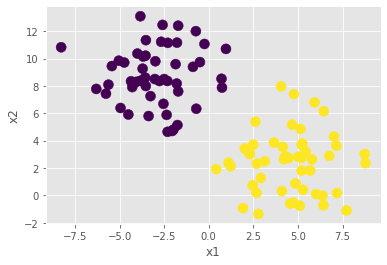
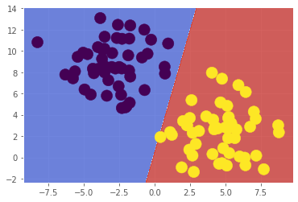
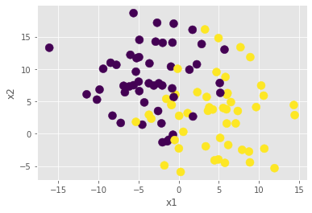
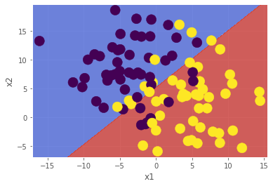

# **Artificial Neural Network**

Mô hình một nơ ron nhân tạo (aritificial neural network) có dạng sau:


Có N input(X1,X2,...,Xn), mỗi input sẽ có trọng số Wi tương ứng. Nơ ron sẽ lấy tổng có trọng số (tổng các Xi * Wi). Sau đó lấy kết quả này so sánh với một ngưỡng nhất định (thông thường với bài toán phân loại 2 vật thì ngưỡng thường là 0). Nếu kết quả lớn hơn ngưỡng thì cho ouput là 1, bé thua ngưỡng thì cho output là 0.


**Quá trình đào tạo một nơ ron:**

Lấy một ví dụ đơn giản: Chúng ta muốn nơ ron phân biệt hai chữ A và B, nếu gặp A thì cho input là 1 còn gặp B thì cho input là 0. Trước tiên chúng ta sẽ phân tích A và B dưới dạng pixel, hình ảnh chữ A và chữ B có thể là như sau: 


Như trên hình thì ta thấy mỗi ảnh có tất cả 5x10 = 50 pixel, ta có thể mã hõa ô có chứa X là 1, còn ô bình thường là 0. Vậy chúng ta có dãy 50 số gồm 0 và 1. Tương đương với việc chúng ta phải có 50 đường truyền để đưa 50 inputs là các số 0, 1 vào nơ ron.

Ban đầu chúng ta sẽ đặt các trọng số ngẫu nhiên và đưa chữ A vào. Nơ ron sẽ lấy tổng có trọng số của các inputs so sánh với 0, nếu dương thì ouput là 1, nếu âm thì output là 0. Mục tiêu của chúng ta là chữ A phải cho output là 1 nên trường hợp nơ ron còn cho output là 0 thì chúng ta phải tăng các trọng số đang hoạt động (các inputs khác 0) lên để cho tổng có trọng số của chúng ta dương và cho output là 1.

Tiếp theo là đưa chữ B vào, tương tự với A nhưng lần này chúng ta cần output là 0 nên chúng ta sẽ giảm trọng số các inputs đang hoạt động xuống.

Bởi vì A và B có các inputs đang hoạt động khác nhau và không hoàn toàn trùng nhau, nên việc thay đổi weighs chưa hẳn sẽ làm thay đổi giá trị của A lúc đầu sau khi truyền B vào. Quá trình training chúng ta cần phải lặp lại quá trình này cho đến khi mạng nơ ron có thể học và nhớ được bài mới.


# Perceptron

Vừa rồi là cách thức hoạt động của một nơ ron, trong phần này chúng ta sẽ áp dụng nó cho một mạng nơ ron đơn giản là Perceptron. Perceptron là một mạng chỉ có một lớp nơ ron:


Thử cài đặt một mạng peceptron:


```python
import numpy as np
class Perceptron(object):
  def __init__(self, lr=0.01, n_iter=10):
    #lr - learning rate, khoảng giá trị chúng ta sẽ điều chỉnh sau mỗi lần lặp
    self.lr = lr
    #số lần lặp
    self.n_iter = n_iter

  def fit(self, X, y):
      #khởi tạo trọng số có giá trị ban đầu = 0
      self.weights = np.zeros(X.shape[1])
      self.bias = 0.0
      #dùng vòng lặp điều chỉnh trọng số cho phù hợp
      for _ in range(self.n_iter):
        for xi, yi in zip(X, y):
          delta = self.lr * (yi - self.predict(xi))
          self.weights += delta * xi
          self.bias += delta    
#hàm dự đoán
  def predict(self, X):
    return np.where(np.dot(X, self.weights) + self.bias >= 0.0, 1, -1)


  
```

Khởi tạo bộ dữ liệu phân loại


```python
from sklearn.datasets import make_blobs
X, y = make_blobs(n_samples=100, centers=2, cluster_std=2.2, random_state=42)
#quá trình phân loại hướng đến nhãn là +1 hoặc -1, nhưng make_blobs trả về 0, 1 nên chúng ta điều chỉnh lại một xíu
y = 2 * y - 1
```


```python
import matplotlib.pyplot as plt
plt.style.use('ggplot')
%matplotlib inline
plt.scatter(X[:, 0], X[:, 1], s=100, c=y)
plt.xlabel('x1')
plt.ylabel('x2')
```


    Text(0, 0.5, 'x2')





```python
p = Perceptron(lr=0.1, n_iter=10)
#Gọi hàm điều chỉnh
p.fit(X, y)
#Trọng số sau khi điều chỉnh
p.weights
```


    array([ 2.20091094, -0.4798926 ])


```python
#độ lệch, biểu thị sự chênh lệch giữa giá trị trung bình mà mô hình dự đoán và giá trị thực tế của dữ liệu.
p.bias
```


    0.2


```python
#accuracy
from sklearn.metrics import accuracy_score
accuracy_score(p.predict(X), y)
```


    1.0


Cuối cùng là vẽ đường decision boundary cho mô hình


```python
def plot_decision_boundary(classifier, X_test, y_test):
  # create a mesh to plot in
  h = 0.02 # step size in mesh
  x_min, x_max = X_test[:, 0].min() - 1, X_test[:, 0].max() + 1
  y_min, y_max = X_test[:, 1].min() - 1, X_test[:, 1].max() + 1
  xx, yy = np.meshgrid(np.arange(x_min, x_max, h), np.arange(y_min, y_max, h))

  X_hypo = np.c_[xx.ravel().astype(np.float32), yy.ravel().astype(np.float32)]
  zz = classifier.predict(X_hypo)
  zz = zz.reshape(xx.shape)

  plt.contourf(xx, yy, zz, cmap=plt.cm.coolwarm, alpha=0.8)
  plt.scatter(X_test[:, 0], X_test[:, 1], c=y_test, s=200)
plot_decision_boundary(p, X, y)
```





Vì perception là bộ phân loại tuyến tính, nên nếu dữ liệu có trộn lẫn vào nhau thì mô hình vẫn chưa thể phân loại một cách rõ ràng:


```python
X, y = make_blobs(n_samples=100, centers=2, cluster_std=5.2, random_state=42)
y = 2 * y - 1
plt.scatter(X[:, 0], X[:, 1], s=100, c=y);
plt.xlabel('x1')
plt.ylabel('x2')
```


    Text(0, 0.5, 'x2')





```python
p = Perceptron(lr=0.1, n_iter=10)
p.fit(X, y)

accuracy_score(p.predict(X), y)
```


    0.81


```python
plot_decision_boundary(p, X, y)
plt.xlabel('x1')
plt.ylabel('x2')
```


    Text(0, 0.5, 'x2')





Để cải thiện việc này, chúng ta sẽ kết hợp nhiều mô hình Perceptron lại với nhau tạo nên mô hình MLP (Multilayer Perceptron)
